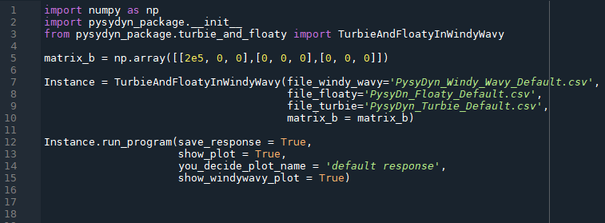
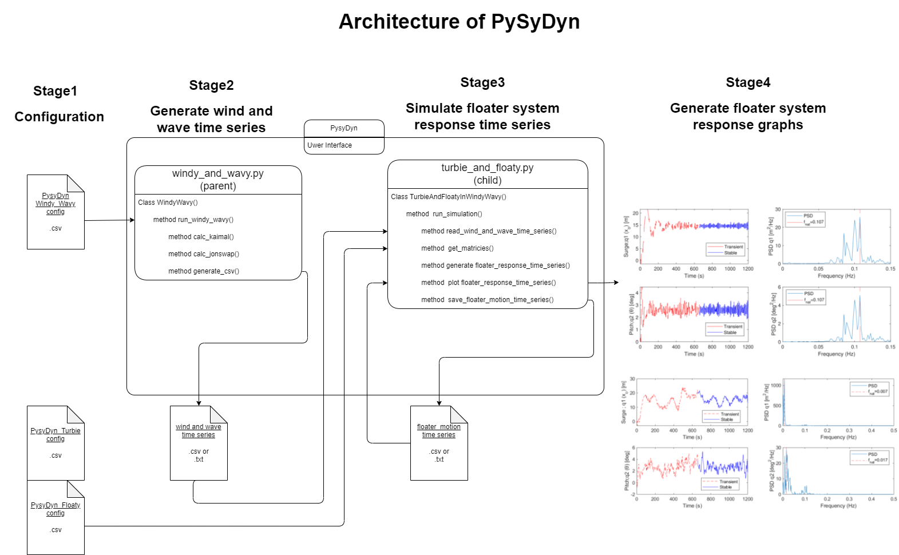
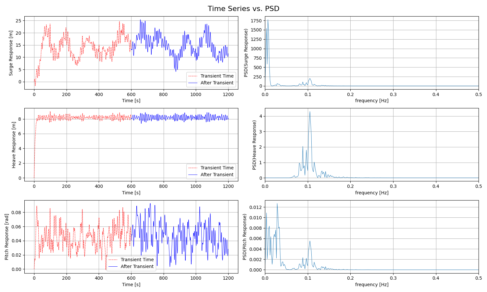

## Objective
The objective of the code was to recreate, improve and expand upon the code created for assignment 5 of the offshore wind course.  
We wanted to to make the code more dynamic allowing the saving and plotting using new variables, add features that saved different datasets allowing for faster reproduction on response simulations and generally improve the readability and speed of the previous code.

The code can generate regular and irregular wind and wave data and calculate the corresponding forces acting on a particular turbine and floater. Using these forces we can calculate the surge, heave and pitch response over time to check floater stability

## Installation
There are two ways to install and run the code, either downloading the repository and running the pysydyn.ipynb file.  
or downloading the pysydyn package from testpypi.

1. In both methods a folder called 'pysydyn' will be created in your C: drive, here all the relevant data will be saved and read from so if you wish to change the config files, it must be done here.

2. (repo) Run 'pysydyn.ipynb' Since the setup has already been created for you, all you need to worry about is having the correct packages for the code to work, these are listed at the bottom of the readme.

   (package) Download the package with the following pip install line:  
pip install -i https://test.pypi.org/simple/ pysydyn-package==0.1.0

3. At the top of your code, initialise the package:  
import numpy as np  
import pysydyn_package.__init__  
from pysydyn_package.turbie_and_floaty import TurbieAndFloatyInWindyWavy  

4. Create a b matrix using a numpy array, if you are unsure of what to use, use the default one given by:  
matrix_b = np.array([[2e5, 0, 0],[0, 0, 0],[0, 0, 0]])

5. Initialise the TurbieAndFloatyInWindyWavy class with the following structure:
Instance = TurbieAndFloatyInWindyWavy(file_windy_wavy='PysyDyn_Windy_Wavy_Default.csv',
                               file_floaty='PysyDn_Floaty_Default.csv',
                               file_turbie='PysyDyn_Turbie_Default.csv', 
                                matrix_b = matrix_b)

The file names given are the file names of the default files.

6. Run the program:
Instance.run_program(save_response = True, show_plot = True, you_decide_plot_name = 'default response', show_windywavy_plot = True)

the program saves your floater response within the "C:/pysydyn" directory as well as all other relevant data

An example of the file is shown here:  

## Code structure
Below is a image representing the code architecture of pysydyn:  

## Results
After the program has successfully run, the wind and wave as well as the response data will be saved in their corresponding folders.  
Below is an image showing typical default results:  

## Improvements
There are several improvements that can be made.
1. The heave response isn't well implemented, it is completely disconnected from the floater and the other two responses. We decided to keep it as it is not a test of our theory knowldge but our coding ability
2. If a user decides to change the floater or turbine data, it will not redo the test as only wind parameters are used in the naming scheme. We tried impletenting this too but the names were so long that windows didnt allow them to be created and had to cut them.
3. The code was only tested on windows and was not tested using mac, as a result, we are unaware whether or not it will work.

## Future work
There are currently no plans to expand and improve the code however, as mentioned above, the heave area can be expanded.

## Peer review
We recieved minor reviews from fellow students about the code  
Pytlint was also able to give a "review", giving us a score of 9.32/10 in the code folder and 9.41/10 in the package folder

## Support
If any errors are encountered, technical support can be offered by the authors at:  
s194770@student.dtu.dk  
s233553@student.dtu.dk  
s240121@student.dtu.dk  

## Authors and acknowledgment
PysyDyn team:  
Tony Feng: s233553  
Oliver Garner: s194770  
Farras Muhammad Fikry: s240121  

Special Thanks:  
Jenni Rinker  
Ju Feng  
Fabio Pierella  
Sithikv Aliyar  
Bogdan Pamfil  
All the code and package testers  

